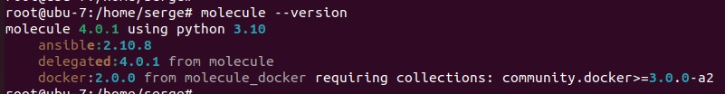
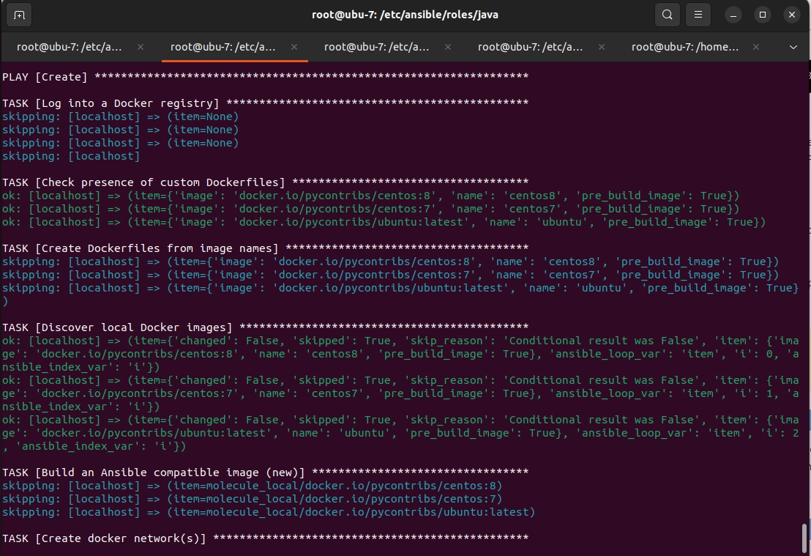
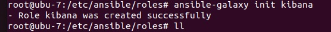
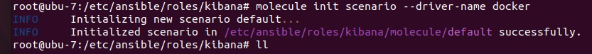
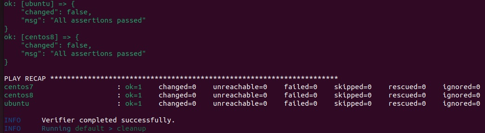

# devops-netology
## Домашнее задание к занятию "08.03 Работа с Roles"

### Подготовка к выполнению

1. Создайте два пустых публичных репозитория в любом своём проекте: elastic-role и kibana-role.
2. Скачайте [role](https://github.com/netology-code/mnt-homeworks/blob/master/08-ansible-03-role/roles) 
 из репозитория с домашним заданием и перенесите его в свой репозиторий elastic-role.
3. Скачайте дистрибутив [java](https://www.oracle.com/java/technologies/javase-jdk11-downloads.html) 
и положите его в директорию playbook/files/.
4. Установите molecule: pip3 install molecule
5. Добавьте публичную часть своего ключа к своему профилю в github.

### Основная часть

Основная цель - разбить наш playbook на отдельные roles. Задача: сделать roles для elastic, kibana 
и написать playbook для использования этих ролей. Ожидаемый результат: существуют два ваших репозитория с roles 
и один репозиторий с playbook.

1. Создать в старой версии playbook файл requirements.yml и заполнить его следующим содержимым:
```bash
 ---
  - src: git@github.com:netology-code/mnt-homeworks-ansible.git
    scm: git
    version: "1.0.1"
    name: java 
```
Ответ: 

Устанавливаем дистрибутив molecule



2. При помощи ansible-galaxy скачать себе эту роль. Запустите molecule test, посмотрите на вывод команды.

3. Перейдите в каталог с ролью elastic-role и создайте сценарий тестирования по умолчаню 
при помощи molecule init scenario --driver-name docker.



Тестируем Java при помощи molecule test

Cоздаем роль Kibana и создайте сценарий тестирования





4. Добавьте несколько разных дистрибутивов (centos:8, ubuntu:latest) для инстансов и протестируйте роль, 
исправьте найденные ошибки, если они есть.

```bash
---
dependency:
  name: galaxy
driver:
  name: docker
platforms:
  - name: centos8
    image: docker.io/pycontribs/centos:8
    pre_build_image: true
  - name: centos7
    image: docker.io/pycontribs/centos:7
    pre_build_image: true
  - name: ubuntu
    image: docker.io/pycontribs/ubuntu:latest
    pre_build_image: true
provisioner:
  name: ansible
verifier:
  name: ansible
```
5. Создайте новый каталог с ролью при помощи molecule init role --driver-name docker kibana-role. 
ожете использовать другой драйвер, который более удобен вам.
6. На основе tasks из старого playbook заполните новую role. Разнесите переменные между vars и default. 
Проведите тестирование на разных дистрибитивах (centos:7, centos:8, ubuntu).
7. Выложите все roles в репозитории. Проставьте тэги, используя семантическую нумерацию.
8. Добавьте roles в requirements.yml в playbook.

```bash
root@ubu-7:/etc/ansible/roles/kibana/molecule# cd ..
root@ubu-7:/etc/ansible/roles/kibana# molecule test
INFO     default scenario test matrix: dependency, lint, cleanup, destroy, syntax, create, prepare, converge, idempotence, side_effect, verify, cleanup, destroy
INFO     Performing prerun with role_name_check=0...
INFO     Set ANSIBLE_LIBRARY=/root/.cache/ansible-compat/805c02/modules:/root/.ansible/plugins/modules:/usr/share/ansible/plugins/modules
INFO     Set ANSIBLE_COLLECTIONS_PATH=/root/.cache/ansible-compat/805c02/collections:/root/.ansible/collections:/usr/share/ansible/collections
INFO     Set ANSIBLE_ROLES_PATH=/root/.cache/ansible-compat/805c02/roles:/root/.ansible/roles:/usr/share/ansible/roles:/etc/ansible/roles
INFO     Using /root/.cache/ansible-compat/805c02/roles/my_namespace.kibana symlink to current repository in order to enable Ansible to find the role using its expected full name.
INFO     Running default > dependency
INFO     Running ansible-galaxy collection install -v --force --pre community.docker:>=3.0.0-a2
WARNING  Skipping, missing the requirements file.
WARNING  Skipping, missing the requirements file.
INFO     Running default > lint
INFO     Lint is disabled.
INFO     Running default > cleanup
WARNING  Skipping, cleanup playbook not configured.
INFO     Running default > destroy
INFO     Sanity checks: 'docker'
[WARNING]: Collection community.docker does not support Ansible version 2.10.8

PLAY [Destroy] *****************************************************************

TASK [Destroy molecule instance(s)] ********************************************
changed: [localhost] => (item=centos8)
changed: [localhost] => (item=centos7)
changed: [localhost] => (item=ubuntu)

TASK [Wait for instance(s) deletion to complete] *******************************
ok: [localhost] => (item=centos8)
ok: [localhost] => (item=centos7)
ok: [localhost] => (item=ubuntu)

TASK [Delete docker networks(s)] ***********************************************

PLAY RECAP *********************************************************************
localhost                  : ok=2    changed=1    unreachable=0    failed=0    skipped=1    rescued=0    ignored=0

INFO     Running default > syntax

playbook: /etc/ansible/roles/kibana/molecule/default/converge.yml
INFO     Running default > create
[WARNING]: Collection community.docker does not support Ansible version 2.10.8

PLAY [Create] ******************************************************************

TASK [Log into a Docker registry] **********************************************
skipping: [localhost] => (item=None) 
skipping: [localhost] => (item=None) 
skipping: [localhost] => (item=None) 
skipping: [localhost]

TASK [Check presence of custom Dockerfiles] ************************************
ok: [localhost] => (item={'image': 'docker.io/pycontribs/centos:8', 'name': 'centos8', 'pre_build_image': True})
ok: [localhost] => (item={'image': 'docker.io/pycontribs/centos:7', 'name': 'centos7', 'pre_build_image': True})
ok: [localhost] => (item={'image': 'docker.io/pycontribs/ubuntu:latest', 'name': 'ubuntu', 'pre_build_image': True})

TASK [Create Dockerfiles from image names] *************************************
skipping: [localhost] => (item={'image': 'docker.io/pycontribs/centos:8', 'name': 'centos8', 'pre_build_image': True}) 
skipping: [localhost] => (item={'image': 'docker.io/pycontribs/centos:7', 'name': 'centos7', 'pre_build_image': True}) 
skipping: [localhost] => (item={'image': 'docker.io/pycontribs/ubuntu:latest', 'name': 'ubuntu', 'pre_build_image': True})

<skip some data>

PLAY RECAP *********************************************************************
centos7                    : ok=4    changed=0    unreachable=0    failed=0    skipped=1    rescued=0    ignored=0
centos8                    : ok=4    changed=0    unreachable=0    failed=0    skipped=1    rescued=0    ignored=0
ubuntu                     : ok=4    changed=0    unreachable=0    failed=0    skipped=1    rescued=0    ignored=0

INFO     Idempotence completed successfully.
INFO     Running default > side_effect
WARNING  Skipping, side effect playbook not configured.
INFO     Running default > verify
INFO     Running Ansible Verifier

PLAY [Verify] ******************************************************************

TASK [Example assertion] *******************************************************
[WARNING]: Collection community.docker does not support Ansible version 2.10.8
ok: [centos7] => {
    "changed": false,
    "msg": "All assertions passed"
}
[WARNING]: Collection community.docker does not support Ansible version 2.10.8
[WARNING]: Collection community.docker does not support Ansible version 2.10.8
ok: [ubuntu] => {
    "changed": false,
    "msg": "All assertions passed"
}
ok: [centos8] => {
    "changed": false,
    "msg": "All assertions passed"
}

PLAY RECAP *********************************************************************
centos7                    : ok=1    changed=0    unreachable=0    failed=0    skipped=0    rescued=0    ignored=0
centos8                    : ok=1    changed=0    unreachable=0    failed=0    skipped=0    rescued=0    ignored=0
ubuntu                     : ok=1    changed=0    unreachable=0    failed=0    skipped=0    rescued=0    ignored=0

INFO     Verifier completed successfully.
INFO     Running default > cleanup
WARNING  Skipping, cleanup playbook not configured.
INFO     Running default > destroy
[WARNING]: Collection community.docker does not support Ansible version 2.10.8

PLAY [Destroy] *****************************************************************

TASK [Destroy molecule instance(s)] ********************************************
changed: [localhost] => (item=centos8)
changed: [localhost] => (item=centos7)
changed: [localhost] => (item=ubuntu)

TASK [Wait for instance(s) deletion to complete] *******************************
FAILED - RETRYING: Wait for instance(s) deletion to complete (300 retries left).
FAILED - RETRYING: Wait for instance(s) deletion to complete (299 retries left).
FAILED - RETRYING: Wait for instance(s) deletion to complete (298 retries left).
FAILED - RETRYING: Wait for instance(s) deletion to complete (297 retries left).
FAILED - RETRYING: Wait for instance(s) deletion to complete (296 retries left).
FAILED - RETRYING: Wait for instance(s) deletion to complete (295 retries left).
changed: [localhost] => (item=centos8)
changed: [localhost] => (item=centos7)
changed: [localhost] => (item=ubuntu)

TASK [Delete docker networks(s)] ***********************************************

PLAY RECAP *********************************************************************
localhost                  : ok=2    changed=2    unreachable=0    failed=0    skipped=1    rescued=0    ignored=0

INFO     Pruning extra files from scenario ephemeral directory
root@ubu-7:/etc/ansible/roles/kibana# 
```



9. Переработайте playbook на использование roles.
10. Выложите playbook в репозиторий.
11. В ответ приведите ссылки на оба репозитория с roles и одну ссылку на репозиторий с playbook.

